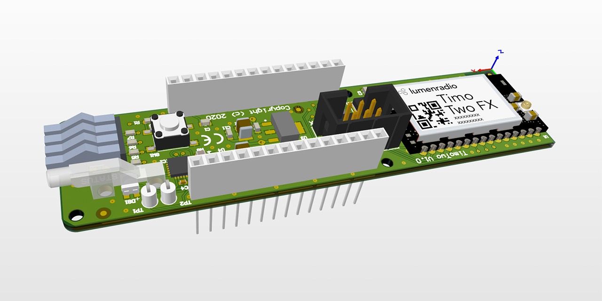

# CRMX_TimoTwo Library
CRMX TimoTwo Library for CRMX TimoTwo MKR Shield (release Q2 2020)

Create Wireless DMX TX/RX with this MKR-shield E1.11 DMX512-A and ANSI E1.20 RDM compliant!
Compatible with Elation / Robe / ARRI /... DMX fixtures, or build your own DIY projects.

Hardware:
- MKR shield board compatible using only SPI and Pin 5 Select / Pin 6 IRQ.
- Based on RadioLumen CRMX TimoTwo transceiver with external antenna.
- ANSI E1.11 - DMX512-A and ANSI E1.20 - RDM.
- Auto selection of the 88 channels possible 2402-2480 MHz (no WiFi connection) Dynamically avoids occupied frequencies.
- 4 LED's on lightguide for status & RF receiving quality.
- 1 RGB LED on lightguide with Universe color.
- Button to Link two devices / clear linking.
- UART DMX/RDM interface 6 pin header with RX/TX and control signals (3V3 compatible) 
  for extention board with 5-Pin XLR galvanic shielded DMX-512.
  - Pin 1: DMX_TXD
  - Pin 2: GND
  - Pin 3: DMX_RXD
  - Pin 4: RS485_DE
  - Pin 5: RS485_RE
  - Pin 6: 3V3
- On board voltage convertors (VIN 5V) to 3V3 and 1V8 to avoid current load on MKR xxxx compatible boards.
- Create Mesh network of devices (firmware release scheduled in 2020).
- The TimoTwo module comprises a BLE based interface that allows for configuration of the device as well as transfer of DMX data to the device (for example Luminair iPad software https://apps.apple.com/us/app/luminair-3-digital-lighting/id920440588?ign-mpt=uo%3D4).

Firmware:
- SPI library to control:
  - Receiver / Transmitter / RF Power modes.
  - Data tranmission / receiving of the DMX universe through SPI. RX/TX is not connected to the MKR shield.
    DMX-512 RX/TX is generated in the TimoTwo chip taking off CPU load & code on the MKR ARM processor.
  - Settings for TX DMX-512 timings (refresh period / time between channels / amount of channels).
  - IRQ settings and flag control for RF reception, new DMX values etc...
  - RX DMX window settings (Start adress and length of window) for easy implementation of creating a DMX fixture.
  - ASC frame start code and frame receiver.
  - Masking of the 88 available TX channels (for fixed installations).
  - Hardware version / firmware version UID readout.
- No need for MKR DMX or RS485 libraries. Can also be used without the RF capability to generate external DMX-512 RX/TX ANSI E1.11 DMX512-A and ANSI E1.20 RDM compliant signals.
  
Copyright (c) 2020 MC-Productions.be

License

This library is free software; you can redistribute it and/or modify it under the terms of the GNU Lesser General Public License as published by the Free Software Foundation; either version 2.1 of the License, or (at your option) any later version.

This library is distributed in the hope that it will be useful, but WITHOUT ANY WARRANTY; without even the implied warranty of MERCHANTABILITY or FITNESS FOR A PARTICULAR PURPOSE. See the GNU Lesser General Public License for more details.

You should have received a copy of the GNU Lesser General Public License along with this library; if not, write to the Free Software Foundation, Inc., 51 Franklin Street, Fifth Floor, Boston, MA 02110-1301 USA
